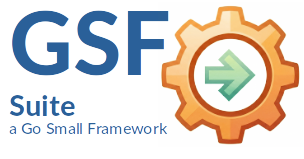

|🇩🇪 [German translation →](README.de.md)|
|----:|
|    |

|| |
|----|----|
|| ***GSF-Suite*** GSF is a collection of small, independent Go modules for building **small services**. Member of **Go Small Frameworks Suite**|

***GSF*** stands für ***Go Small Frameworks*** — a collection of minimalist tools for robust applications.

### Overview

GSF is a collection of small, independent Go modules for building **small and simple services**.
The focus is on **clarity, low dependencies, and composability**, following a pragmatic *"90% solution"* philosophy.

This repository (`nexIO`) contains the Go implementation of GSF.

GSF (Go Small Frameworks) provides a set of minimal infrastructure building blocks for microservices and service-oriented systems.

The modules are intentionally small and focused. Each module:
- solves one problem
- can be used independently
- avoids unnecessary abstractions
- prefers explicit composition over magic

GSF is **not** a full-stack framework and does not try to replace existing ecosystems.

---

### Design Principles

- **Simplicity first** – small APIs, clear responsibilities
- **90% solutions** – practical over perfect
- **Low dependencies** – standard library where possible
- **Loose coupling** – modules communicate via interfaces
- **Language-agnostic architecture** – suitable for polyglot systems

---

### Modules

Please also refer to the README files in the respective modules.

---

#### nexIOnode (pkg/node)

The core of bidirectional communication. It breaks with the classic client-server paradigm and replaces it with a symmetrical peer architecture.

* **Symmetry:** Each node can register methods and simultaneously send requests to its partner as a client.
* **Resilience Engine:** An integrated state machine monitors the connection and uses exponential backoff for reconnection without blocking the running application logic.
* **Type Safety:** Go generics (`Bind[T]`) securely convert JSON-RPC parameters into native Go structures.

---

#### nexIOlog & nexIOlog/rotate (pkg/gsflog)

A high-performance, structured logging system optimized for long-term operation in microservices.
* **Interface Abstraction:** Decoupled via the `LogSink` interface, the logger can be deployed in any module (RPC, Transport, Scheduler) without creating hard dependencies.
* **Atomic Rotation:** Implements robust file rotation with a `.LOCK` mechanism. Each log event is written atomically (Open -> Write -> Close), guaranteeing maximum integrity even in the event of system crashes.
* **Contextual Logging:** Supports enriching log entries with contextual data (`With`) to enable tracing across distributed nodes.

##### `gsflog`

A minimal logger with log levels and structured fields.

- Writes to any `io.Writer`
- No archiving, rotation, or retention
- Not a replacement for established logging frameworks

Responsibilities:
> Format and output log messages

---

#### `gsflog`
A minimal logger with log levels and structured fields.

- Writes to any `io.Writer`
- No log retention, rotation, or compression logic
- No replacement for `slog`, `zerolog`, etc.

Responsibility:
> Format and emit log messages

---

#### `rotate`
A generic file rotation module.

- Works on files only (not log-specific)
- Rotation based on size and/or time
- Archive and retention strategies are pluggable
- No logging dependency

Responsibility:
> Handle files according to rotation policies

---

#### nexIOschedule (pkg/schedule)

A precise scheduler for recurring tasks within the nexIO ecosystem.

* **Interface-Driven:** Tasks are defined via a simple interface, enabling the execution of any Go function.
* **Concurrency-Safe:** The scheduler is designed to manage hundreds of parallel jobs without impacting the real-time capability of RPC communication.
* **Fault Tolerance:** If a job fails, it is logged with full context via the integrated `nexlog` system.

- Periodic Jobs (`Every`)
- One-Time Jobs (`At`)
- Panic-Safe Execution
- Optional Logger Interface

Responsibility:
> Scheduled Job Execution

---

### Composition Model

GSF modules are designed to be composed explicitly:

- `gsflog` writes to an `io.Writer`
- `rotate.Writer` implements `io.Writer`
- `schedule` can trigger rotations or reopen operations

There are **no hard dependencies** between modules.
Integration happens in the application layer.

---

### Examples

The `cmd/` directory contains runnable examples:

- `cmd/main.go` – full example (logger + rotation + scheduler)
- `cmd/rotate/main.go` – standalone rotation example
- `cmd/schedule/main.go` – scheduler example
- `cmd/node/gsfNodeExample/.../main.go` – Interaction of 3 nodes

Each example is self-contained and meant as documentation by code.

---

### Non-Goals

GSF deliberately does **not** provide:

- distributed logging
- tracing
- metrics
- service discovery
- configuration frameworks

GSF is infrastructure glue, not a platform.

---

### Organizational & Standards

* **Copyright:** © 2026 Georg Hagn.
* **Namespace:** All modules follow the naming convention `github.com/georghagn/nexIO/pkg/...`.
* **Clean Code:** Strict separation of transport logic (WebSockets) and application logic (RPC).

---

### License

Licensed under the Apache License, Version 2.0.

---

## Contributing & Security

Contributions to the GSF Suite are welcome — including bug reports,
improvements, and pull requests.

Please refer to:
- Contribution guidelines: see `CONTRIBUTING.md`
- Responsible disclosure of security issues: see `SECURITY.md`

For general bugs or feature ideas, please use GitHub Issues.
Security-related topics should **not** be discussed publicly.

